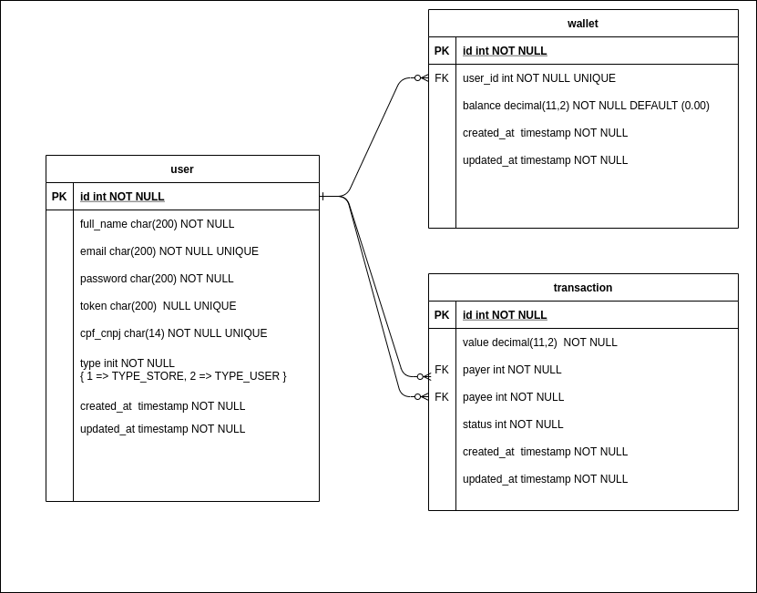

    <h2 align="center">Projeto Api</h2>
     

## Framework
Vou utilzar a mesma esplicação que utilizei no meu TCC XD. 
Foi utilizado o framework YII2 para a construção da API REST. Os modelos utilizados são Active Records. 

> O Active Record fornece uma interface orientada a objetos para acessar
> e manipular dados armazenados em bancos de dados. Uma classe Active
> Record está associada a uma tabela da base de dados, uma instância do
> Active Record corresponde a uma linha desta tabela, e um atributo
> desta instância representa o valor de uma coluna desta linha. Em vez
> de escrever instruções SQL a mão, você pode acessar os atributos do
> Active Record e chamar os métodos do Active Record para acessar e
> manipular os dados armazenados nas tabelas do banco de dados (YII,
> acesso em outubro de 2018).

  
Estrutura de Diretorios
-------------------
Temos a estrutura basica do YII2 e eu vou dar uma explicada rapida em cada diretorio. 
.docker/  
nesse diretorio ficam os arquivos referentes ao docker, tera uma sessao para explicar sobre o uso do docker nesse projeto. 
commands/  
diretorios referentes ao comandos, geralmente algo que sera executado pelo cron similar aos jobs do laravel 
config/  
diretorio com os aquivos referentes as configuracoes do framework, um arquivo em especifico o web.php contem todas as configuracoes mais as rotas das apis. 
controllers/  
diretorio com as classes referentes aos controllers 
documentacao/  
diretorio com arquivos referente a documentacao do sistema. 
migrations/  
diretorio com as classes de migrations, para versionamento do banco em codigo. 
models/  
diretorio com as classes referentes aos modelos. 
modules/  
diretorio com os modules, cada modulo possui seus diretorios de models e controllers  
tests/  
diretorio para as classes de testes 
web/  
diretorio similar ao public do laravel, onde fica o apontamento e carrega as classes do framework. 

Estrutura do Projeto
-------------------
#### Modelo Relacional

##### Todos os modelos nos 3 modulos semguem as tabelas pois todos sao active records
#### Foi criado 3 modulos de api
##### chamadas / 
 usa a estrutura padrao do Yii2 tendo seus modelos em models e seus controles em controllers, a configuracao de roteamento esta em config/web.php na linha 46 toda a parte de urlManager é referente ao roteamento, essa api nao utiliza nenhum padrao de autenticação e seguranca, toda a transaction é realizada por transaction de banco de dados quando ocorre algum erro é realizado um rollback para desfazer todas as operacoes assim não guardando nenhuma informacao

#### chamadas /security/
Nessa api existe autenticacao via JWT outras implementacoes por exemplo o usuario só consegue ver sua propria wallet, e só consegue ver os valores de transactions que ele participou. possui o mesmo esquema de transaction de banco de dados

#### chamadas /nodbt/
Nao possui autenticacao e a reversao ao ocorrer algum tipo de erro é realizada sem transaction de banco de dados.

documentação da api com suas chamadas e exemplos
[https://documenter.getpostman.com/view/1908250/Tz5m6ygv](https://documenter.getpostman.com/view/1908250/Tz5m6ygv)

#### Model User
Modelo que representa a tabela user, para os modules commom e o nodbt ele só serve para trazer os dados, não foi implementado nada mais além das regras basicas e os filds que deve trazer nas consultas. 
Já no module security o mesmo tem outras funcoes como o generateToken, que é uma funcao para gerar o token JWT, além de sua authenticacao

#### Model Wallet
Modelo que representa a tabela wallet, para os modules commom, security e nodbt a Wallet funciona praticamente igual tendo as funcoes deposit e withdrawn. 
A funçao deposit funciona quando o valor é depositado na wallet de outro ususario e dentro dela que é realizado a notificacao que o valor foi recebido. 
A função withdrawn funciona quando o valor é retirado para ser transferido e é nessa função que a api manda uma requisição para saber se está autorizado ou não. 
O Module nodbt tem mais duas funções que são o revertDeposit e revertWithdrawn que servem para fazer a reversão dos valores.  

#### Model Transaction
Modelo que representa a tabela transaction, para os modules commom, security e nodbt a transaction é igual. Sendo responsavel por todas as regras de validação exceto a verificação de autorização no serviço de terceiros.

#### Controller User
Controller que representa as chamadas referente aos users, nos modules commom e nodbt funciona exatamente igual, trazendo todos os dados sem a necessidade de authenticação, já no module security é necessario um token e o
usuario do token só pode ver os valores de sua propria wallet.

#### Controller Transaction
Controller que representa as chamadas referente as transactions.
No module commom e nodbt as chamdas gets (list e view) trazem todos os valores sem nenhum criterio. 
No module security as chamdas gets (list e view), necessario envio do token, só trazem todos os valores exceto o value da transaction caso o usuario não participou da mesma. 
No module commom e security a chamda post (create), precisa dos dados descrito na documentação da api e caso ocorra uma incosistencia a mesma não é realizada por causa do rollback, a diferença entre o commom e security 
é que no security o payer é sempre o usuario authenticado.
No module nodbt é parecido com o do module commom a diferençã é que não tem rollback e a reversão é feita a partir de modificações na wallet.

#### Controller Transaction

##### Dados 
como não foi criado a api para cadastro de usuarios, foi criado um migration para popular o banco com usuarios apra fins de teste.  
Os usuario seguem a nomeclatura user1@apiprocesso.teste ... até user5@apiprocesso.teste os 3 primeiros sao usuarios comuns e os 2 ultimos são usuarios tipos de loja.  
cada qual teve um valor especifico na wallet. 

Estrutura Docker
---------------------
O docker-compose foi separado em 3 containers diferentes um container para a api, um para o mysql e o ultimo com o adminer para acessar o banco com mais facilidade. 
existe um .env com as configuracoes necessarias para rodar o docker-compose. 
os arquivos referentes ao docker ficam no diretorio .docker/ 
o mesmo possui 3 diretorios mais um arquivo de comando. 
diretorio app/ possui arquivos que seram subistituidos no yii2 sempre que rodar um compose up e possui o dockerfile com a configuracao docker da api. 
foi utilizado o dockerize para fazer essas subistituicoes. 
o diretorio dbdata é o responsavel peloas arquivos de banco 
o diretorio httpd é aonde ficam as configuracoes do apache que o container da api utiliza 
e o arquivo entrypoint.sh é o entrypoint do container da api o mesmo instala os arquivos do compose caso não nao esteja instalado. 

O que é necessario para rodar ?
---------------------

 1. Baixar o projeto
 2. Copiar o .env.example para um .env
 3. Rodar o docker-compose up ( o mesmo ja ira instalar as dependencias do yii2 e rodar as migrations)
 4. Pronto já pode realizar os testes :D
