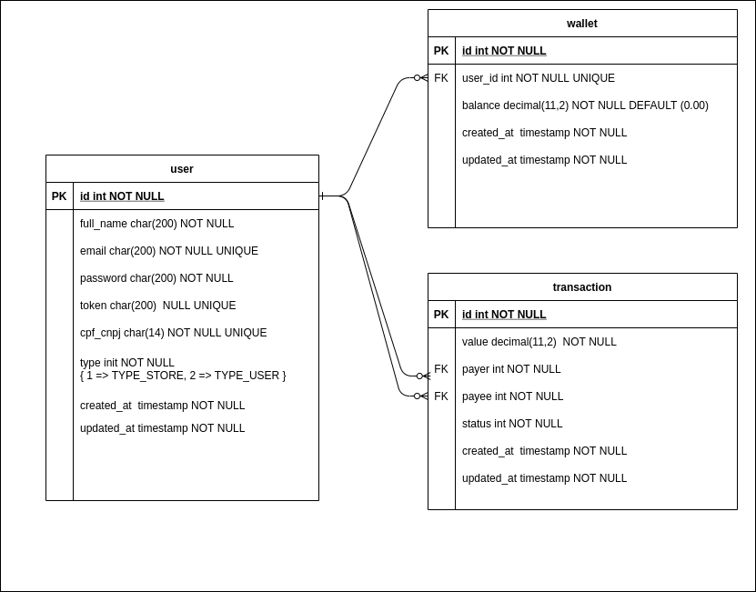

# Projeto Api

## Framework

Foi utilizado o framework YII2 para a construção da API REST. Os modelos utilizados são Active Records.


> O Active Record fornece uma interface orientada a objetos para acessar
> e manipular dados armazenados em bancos de dados. Uma classe Active
> Record está associada a uma tabela da base de dados, uma instância do
> Active Record corresponde a uma linha desta tabela, e um atributo
> desta instância representa o valor de uma coluna desta linha. Em vez
> de escrever instruções SQL a mão, você pode acessar os atributos do
> Active Record e chamar os métodos do Active Record para acessar e
> manipular os dados armazenados nas tabelas do banco de dados (YII,
> acesso em outubro de 2018).

  
Estrutura de Diretorios
-------------------
Temos a estrutura basica do YII2 e eu vou dar uma explicada rapida em cada diretorio.


```
.
└───.docker (arquivos referentes ao docker)
│   │   
│   └───app (arquivos referente ao container da api)
│       │   db.php (arquivo usado para modificacoes de configuracoes referente ao db no yii2)
│       │   Dockerfile 
│       │   env.php (algumas variaveis que sao utilizadas para o JWT)
│   
└───commands (controllers que geralmente sao chamados por robos, similar aos jobs do laravel)
│
│
└───config (aquivos referentes as configuracoes do framework)
│   │   web.php (principal arquivo de configuracao, para as entradas externas)
│   │   console.php (principal arquivo de configuracao, para os commands)
│  
│
└───controllers
│   │   NoSecurity.php  
│   │   TransactionController.php
│   │   UserController.php
│ 
│ 
└───documentacao (documentacao do sistema)
│   │ modelo_relacional.png 
│   │ README.md
│   │ 
│ 
└─── migrations (versionamento do banco em codigo)
│   | m210305_182717_create_table_user.php ( cria a tabela user)
│   | m210305_190039_create_table_wallet.php ( cria a tabela wallet)
│   | m210305_190056_create_table_transaction.php (cria a table transaction)
│   | m210306_131921_seed_user_and_wallet.php (popula as tabelas user e wallet)
│ 
│ 
└───models
│   │ Transaction.php    
│   │ User.php   
│   │ Wallet.php
│ 
│ 
└───modules
│   │
│   └───nodbt
│   │   │  
│   │   │  
│   │   └───controllers   
│   │   │  
│   │   └───models   
│   │   │  Module.php
│   └───security
│       │   
│       │  
│       └───controllers   
│       │  
│       └───models   
│   
│ 
│ 
└───tests
│ 
│ 
└───web (similar ao public do laravel, onde fica o apontamento e carrega as classes do framework)
```


Estrutura do Projeto
-------------------
#### Modelo Relacional



#### **Todos os modelos nos 3 modulos seguem as tabelas pois todos sao active records**


#### Foi criado 3 modulos de api


##### chamadas: **/**
 Utiliza a estrutura padrão do Yii2, tendo seus modelos em models e seus controles em controllers. A configuração de roteamento está em config/web.php na linha 46, toda a parte de urlManager é referente ao roteamento. Essa api não utiliza nenhum padrão de autenticação e segurança. Toda a transaction é realizada por transaction de banco de dados logo, quando ocorre algum erro é realizado um rollback para desfazer todas as operações, assim não guardando nenhuma informação daquela transferência.

#### chamadas: **/security/**
Nessa api existe autenticacao via JWT e outras implementações. Por exemplo, o usuario só consegue ver sua propria wallet, e só consegue ver os valores de transactions que ele participou. Possui o mesmo esquema de transaction de banco de dados.

#### chamadas: **/nodbt/**
Não possui autenticação, e a reversão ao ocorrer algum tipo de erro é realizada sem transaction de banco de dados.

Documentação da api:
[Postman](https://documenter.getpostman.com/view/1908250/Tz5m6ygv)

#### **Model User**
Modelo que representa a tabela user. Para os modules commom e o nodbt ele só serve para trazer os dados, não foi implementado nada mais além das regras básicas e os fields que deve trazer nas consultas.

Já no module security o mesmo tem outras funções como o generateToken, que é uma funcao para gerar o token JWT, além de sua autenticação.

#### **Model Wallet**
Modelo que representa a tabela wallet. Para os modules commom, security e nodbt a Wallet funciona praticamente igual, tendo as funções deposit e withdraw.

A função deposit funciona quando o valor é depositado na wallet de outro usuário e dentro dela que é realizado a notificação que o valor foi recebido.

A função withdraw funciona quando o valor é retirado para ser transferido e é nessa função que a api manda uma requisição para saber se está autorizado ou não.


O Module nodbt tem mais duas funções que são o revertDeposit e revertWithdraw que servem para fazer a reversão dos valores.


#### **Model Transaction**
Modelo que representa a tabela transaction. Para os modules commom, security e nodbt a transaction é igual. É responsável por todas as regras de validação exceto a verificação de autorização no serviço de terceiros.

#### **Controller User**
Controller que representa as chamadas referente aos users. Nos modules commom e nodbt funciona exatamente igual, trazendo todos os dados sem a necessidade de autenticação, já no module security é necessário um token e o usuário do token só pode ver os valores de sua propria wallet.

#### **Controller Transaction**
Controller que representa as chamadas referente as transactions. No module commom e nodbt as chamadas gets (list e view) trazem todos os valores sem nenhum critério.

No module security as chamadas gets (list e view) é necessário o envio do token para autenticação do usuário. Todos os campos são retornados, porém o campo value só é retornado quando o usuário participa da transação. 


No module commom e security a chamada post (create) precisa dos dados descritos na documentação da api e caso ocorra uma inconsistência, a transaction não é realizada por causa do rollback. A diferença entre o commom e security é que no security o payer é sempre o usuário autenticado. No module nodbt é parecido com o do module commom a diferença é que não tem rollback e a reversão é feita a partir de modificações na wallet.

#### Controller NoAuth
Possui apenas a função para realizar o login, recebendo um token JWT para utilizar nas outras chamadas.

#### Controller NoSecurity
É uma classe padrao para ser extendida por controllers que não necessitaram de autenticação poder extender da mesma.

#### Controller Security
É uma classe padrao para ser extendida por controllers que necessitaram de autenticação.
##### Dados 
Como não foi criado a api para cadastro de usuários, foi criado um migration para popular o banco com usuários para fins de teste.

Os usuários seguem a nomeclatura user1@apiprocesso.teste ... até user5@apiprocesso.teste os 3 primeiros são usuários comuns e os 2 últimos são usuarios lojistas.

Cada qual teve um valor específico na wallet.


Estrutura Docker
---------------------
O docker-compose foi separado em 3 containers diferentes: um container para a api, um para o mysql e o último com o adminer para acessar o banco com mais facilidade.

Existe um .env com as configurações necessárias para rodar o docker-compose.

Os arquivos referentes ao docker ficam no diretorio .docker/

O mesmo possui 3 diretórios mais um arquivo de comando.

O diretorio app/ possui arquivos que serão
substituídos no yii2 sempre que rodar um docker-compose up e possui o dockerfile com a configuração docker da api.

Foi utilizado o dockerize para fazer essas substituições.

O diretorio dbdata é o responsável pelos arquivos de banco.

O diretorio httpd é aonde ficam as configurações do apache que o container da api utiliza, e o arquivo entrypoint.sh é o entrypoint do container da api. O entrypoint.sh instala os arquivos do framework caso não esteja instalado, além de rodar as migrations automaticamente.


